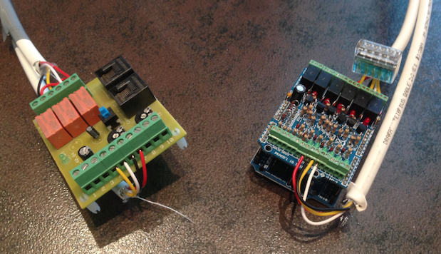

# FlexitServer

Small "REST-like" web-server interface to a Flexit air handling unit

## Hardware:

The Flexit unit is interfaced via an Arduino UNO with an IO shield,
and running the [ArduinoIO](https://github.com/TrondKjeldas/ArduinoIO.git) sketch.

Documentation for the Flexit interface card: [SP425](http://www.flexit.no/produkter/luftbehandlingsaggregater/Tilbehor-kanalsystem/Tilbehor/SP425-Styringskort-for-sentralstyring-SD/)

## Docker:

Build cmd: sudo docker build -t flexi-server . 

Run cmd: sudo docker run --device /dev/ttyACM0 --rm --net=host flexi-server
